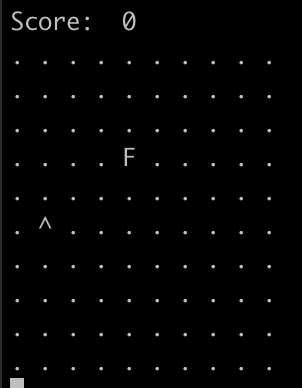

# viborracha
Genetic algorithm with neural network to play the snake game

## Usage

To start the evolution. This will generate `weights.txt` and `bias.txt` files
```
python3 evolve.py
```

To play the game with the model already evolved. This will load `weights.txt` and `bias.txt` files
```
python3 play.py
```

## Model

The model is a simple neural network
```
Input: 9 nodes
Hidden layer: 6 nodes
Output: 3 nodes
```

### Input
The input of the neural network is the snake vision in 3 directions (relative to the snake): left, front, right. Each vision is composed of 3 values:
```
- 0/1 flag indicating if there is an obstacle in the next square
- 0/1 flag indicating if there is food in sight
- 0..1 value indicating the normalized distance to the tail
```

### Output
Indicates if the snakes should go left, forward, or right.

## Example
This is the result for the evolution of 20 generations of 1000 individuals in a game with size 10x10.



## Some conclusions
At first, I tried with a simplier input, just using this for each direction vision

```
- 0/1 flag indicating if there is an obstacle in the next square
- 0/1 flag indicating if there is food in sight
```

But the result of the evolution with that input ended up with a snake that was good at caching food but really bad at not crashing with its tail. So I added the distance to the tail to the input and that, somehow, ended up with a snake with a more twisting behaviour that makes it last longer in the game. 

There is a lot of room for improvement but I don't want to spend more time on this UwU
